## 📈 Prints do Swagger

* Criação de anime
* Atualização
* Consulta com filtros
* Exclusão lógica

### Get All

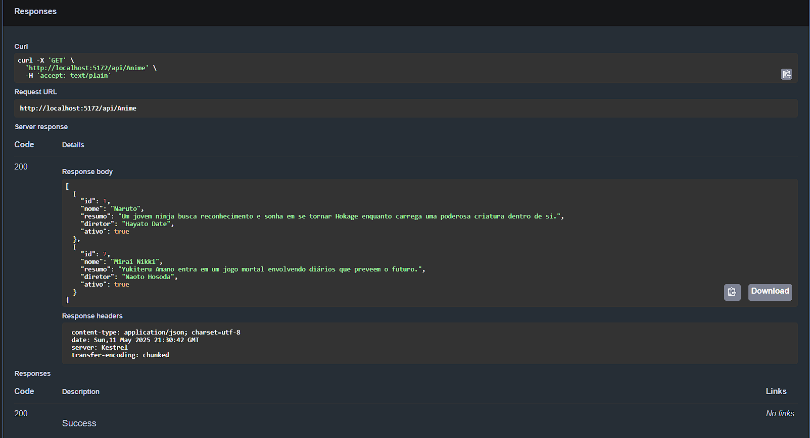

### Get by Nome
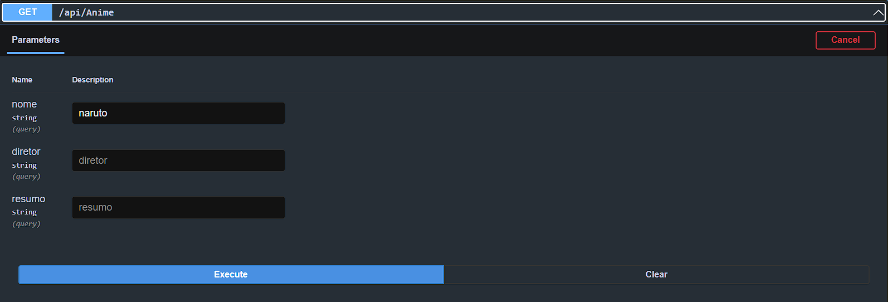

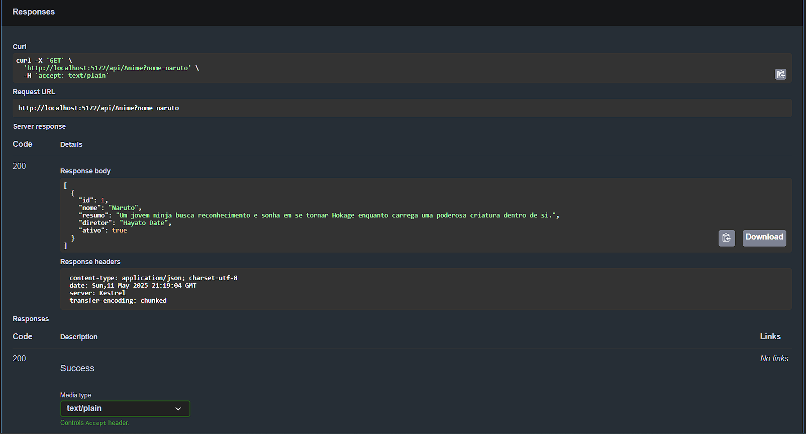

### Get by Diretor
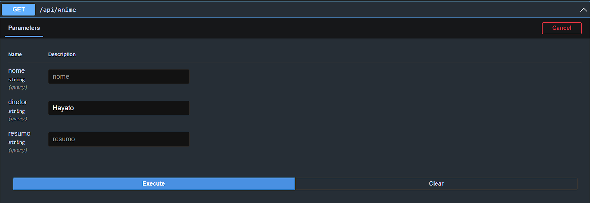

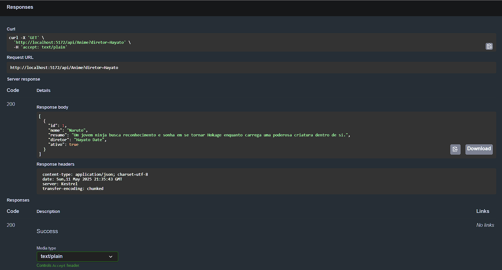

### Get by Resumo
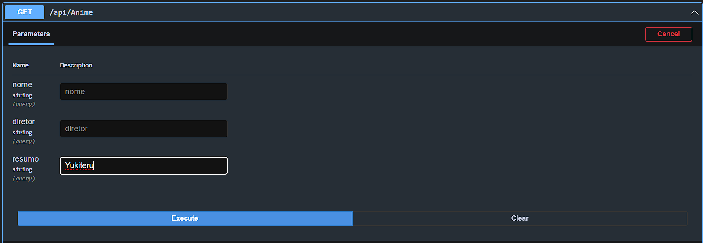

### Post
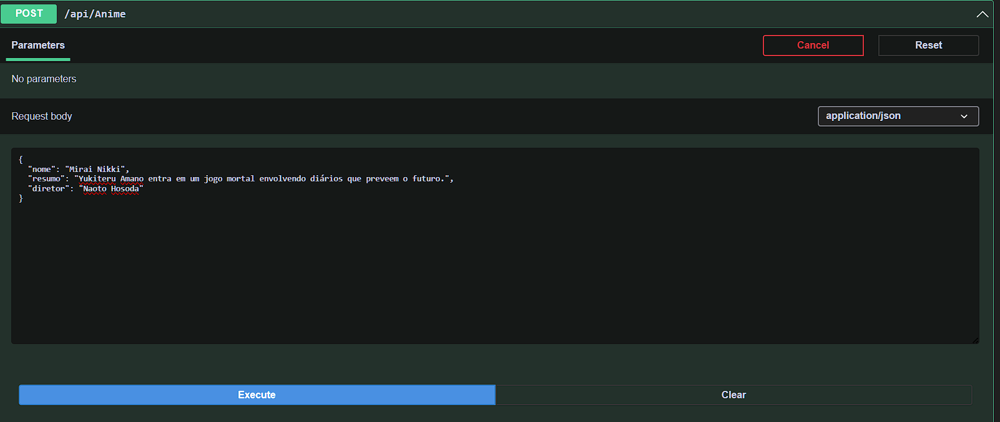

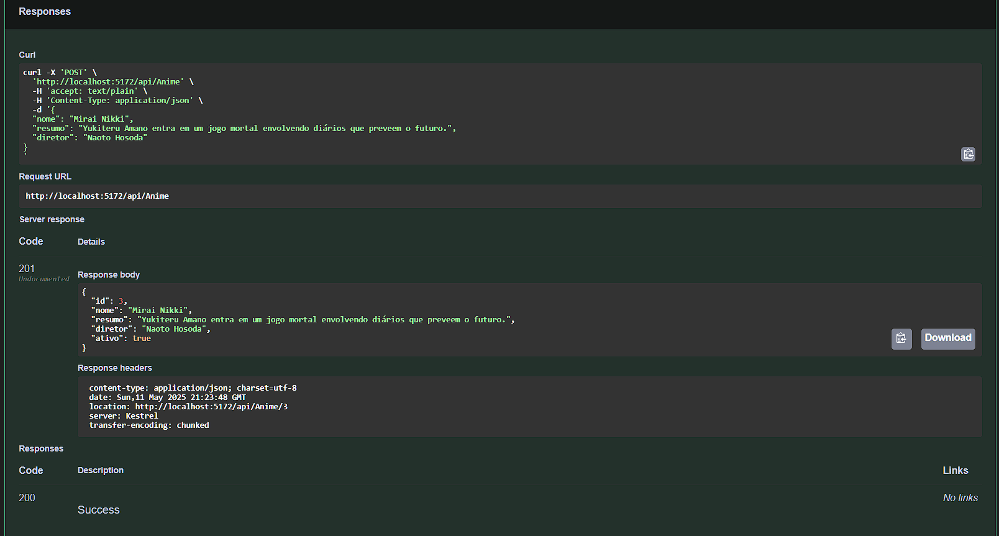

### Put
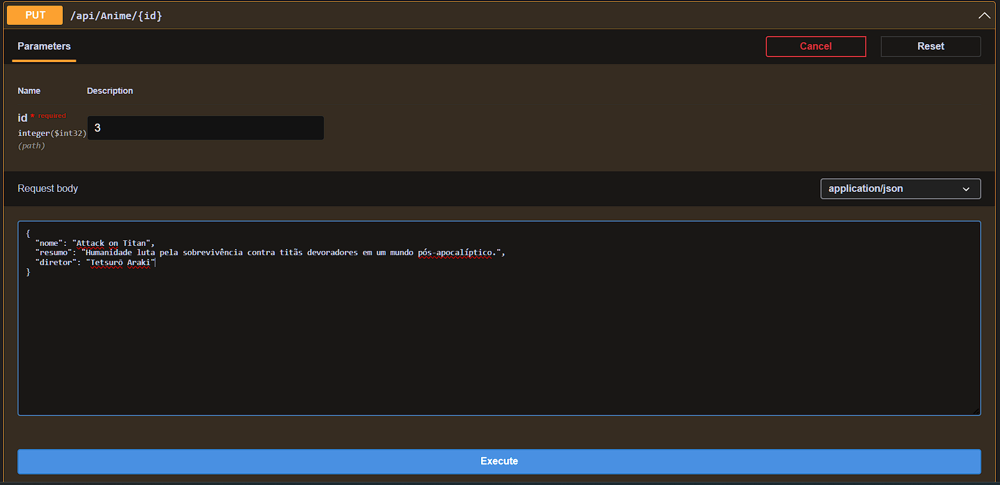

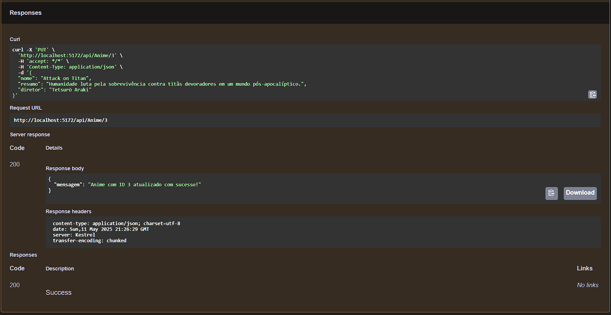

### Delete
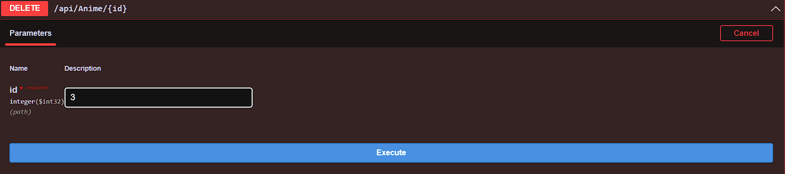

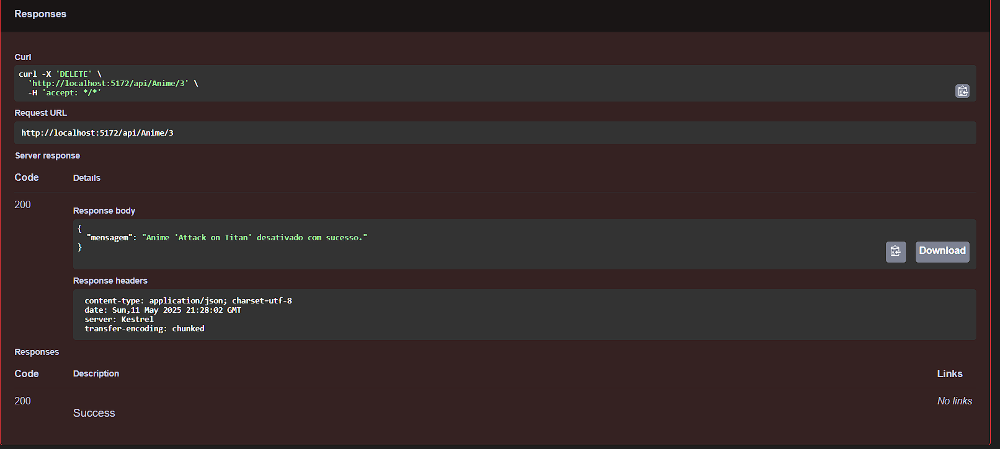

## 🔧 Testes Automatizados

### Testes realizados com xUnit + EF Core InMemory:

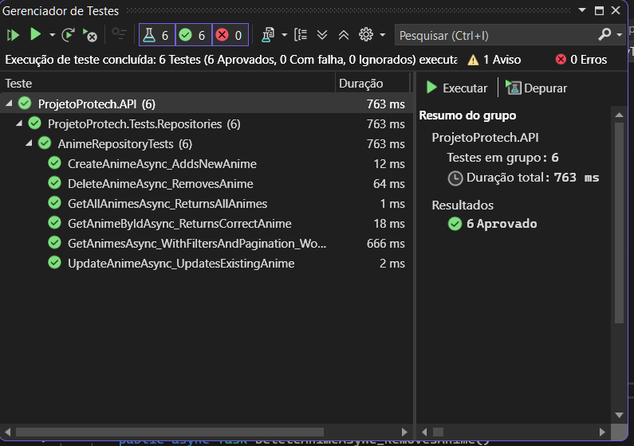
